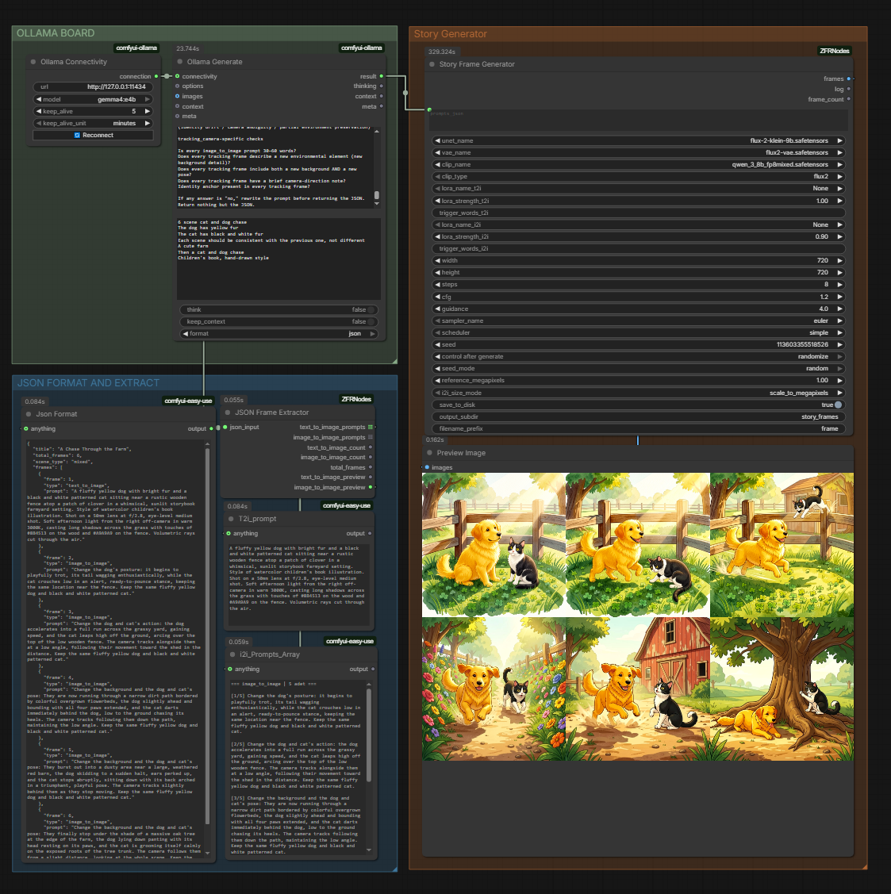
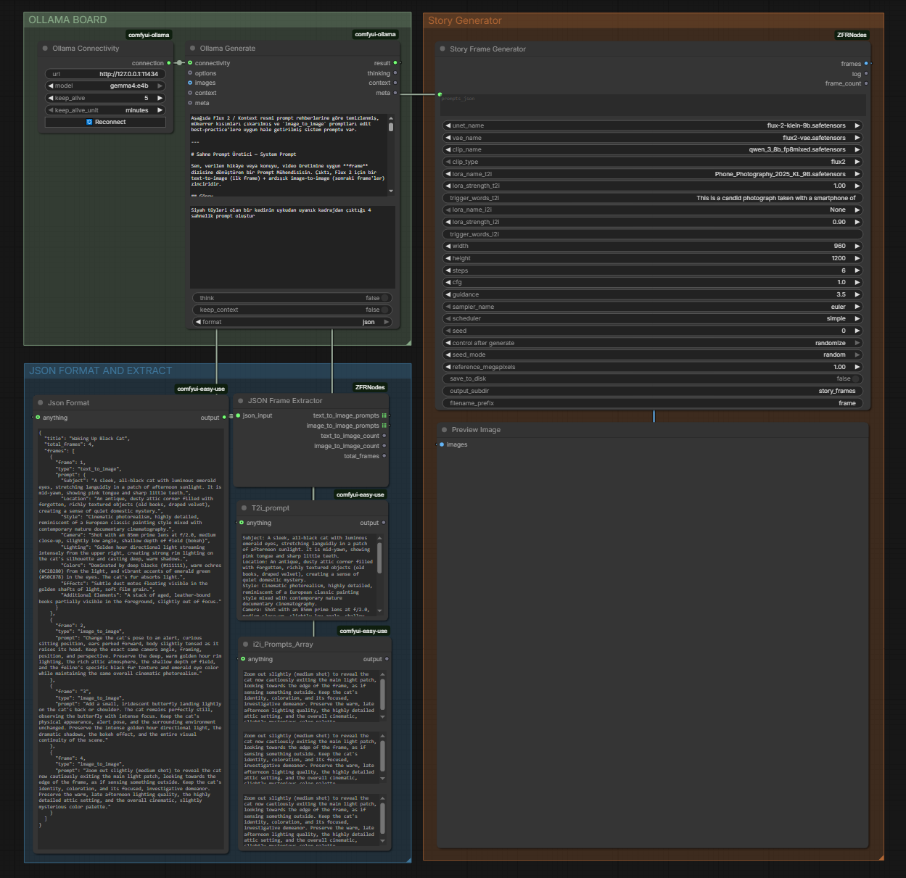
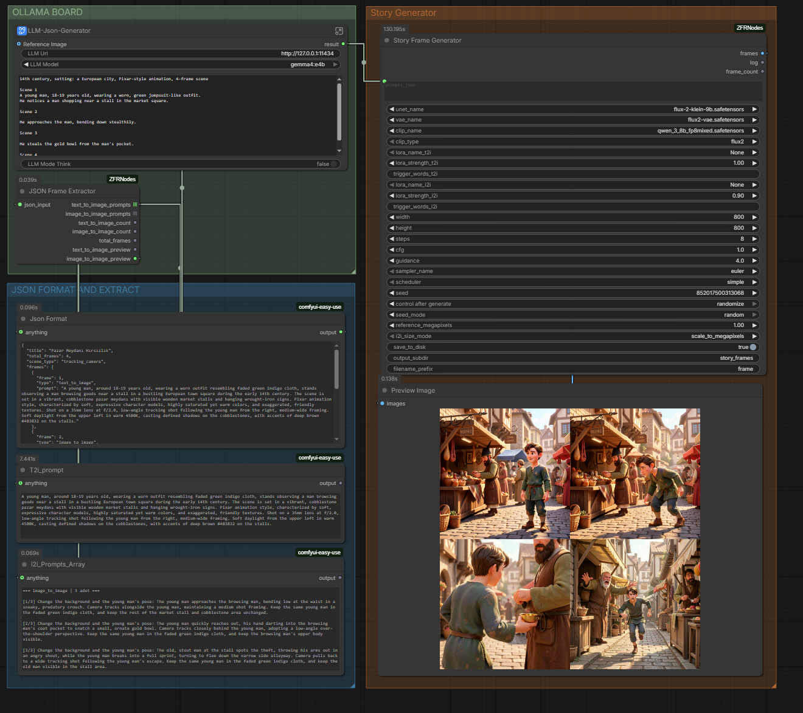
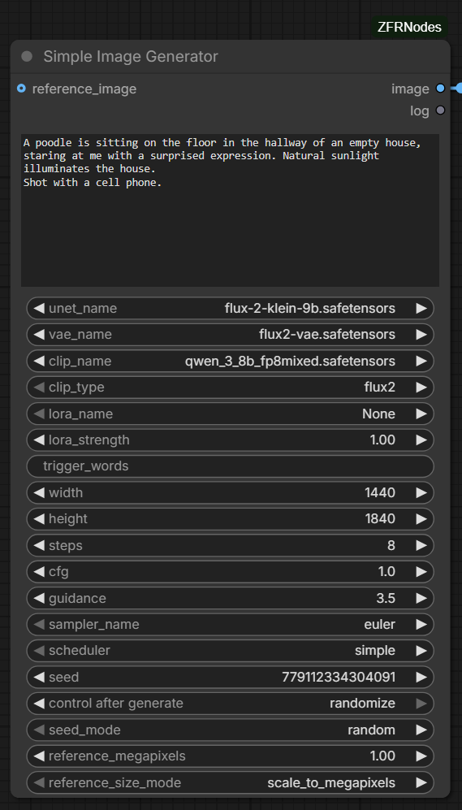
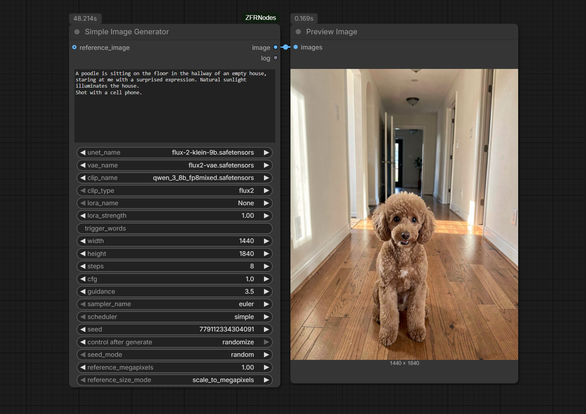
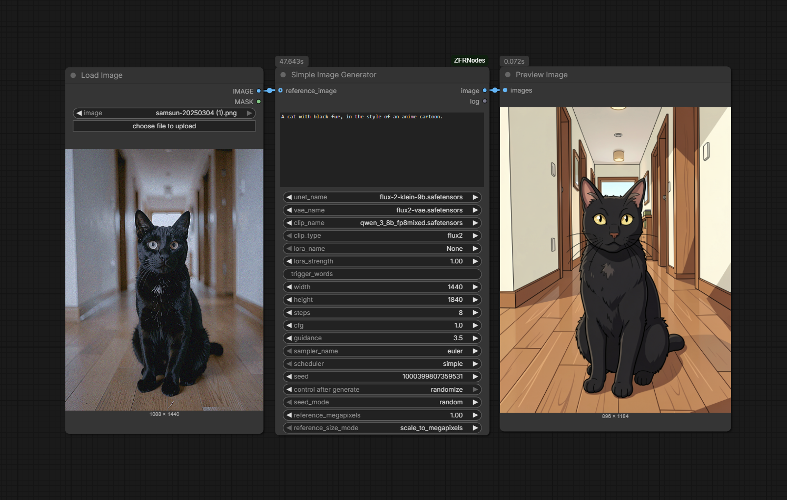
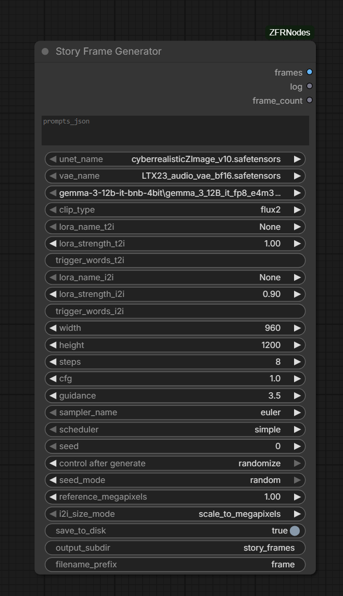
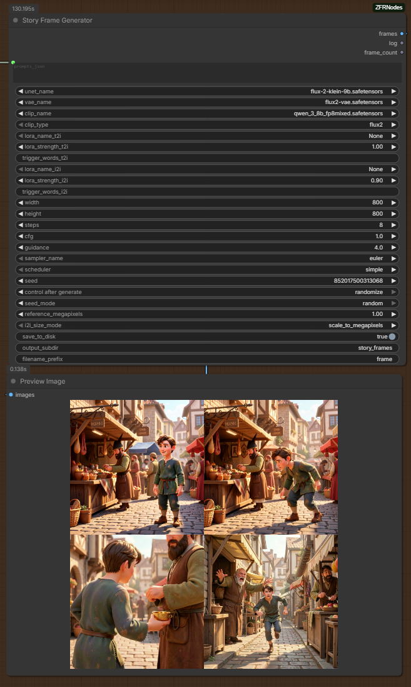

# ComfyUI-ZFRNodes

> Generate a **whole, consistent multi-frame story** from a single JSON prompt — in one node, one queue run.

ComfyUI custom nodes for **story / sequence image generation** and single-image
text-to-image + image-to-image, plus a few small type/JSON helper nodes.

The headline node, **Story Frame Generator**, takes a JSON describing a sequence of frames
(first a text-to-image shot, then image-to-image edits) and produces the entire chain
inside one node — each frame continuing from the previous one — so you don't need to wire
six samplers or queue the graph repeatedly.

---

| Story preview | Workflow |
| --- | --- |
|  |  |

---

## Why this exists

ComfyUI's graph can't feed a node's output back into the next iteration within one run
(no feedback loops). So generating "frame N edits frame N-1" normally means either chaining
many samplers by hand or re-queuing with manual indexing. **Story Frame Generator runs the
loop *inside* the node**, keeping the resolution fixed across the chain to avoid the gradual
"fading"/drift you get when reference and sampler sizes drift apart.

## Nodes (category: `zfr-nodes`)

| Node | What it does |
| --- | --- |
| **Story Frame Generator** | Reads frame JSON, generates the full sequence (t2i then chained i2i) in one node. Returns all frames as one IMAGE batch and saves them to disk. |
| **Simple Image Generator** | Single image from a prompt. Optional `reference_image` switches it to image-to-image (edit) mode. |
| **JSON Frame Extractor** | Parses the frame JSON; outputs prompt lists, per-type counts, and human-readable preview strings for debugging. |
| **Convert To Integer / Float / String / Boolean** | Small type-conversion utilities. |

## Requirements

- ComfyUI with Flux-style model support, ideally a Flux2-compatible build such as `flux-2-klein`.
- Python packages: `numpy`, `torch`, `Pillow` (these are usually already installed by ComfyUI).
- A compatible diffusion model, VAE, and text encoder for the chosen `clip_type`.
- For LLM-driven prompt generation, the ComfyUI Ollama node: https://github.com/stavsap/comfyui-ollama.
- A `requirements.txt` file is included for quick dependency installation with `pip install -r requirements.txt`.

## Installation

### Via ComfyUI-Manager
Search for **ComfyUI-ZFRNodes** in the Manager and install, then restart ComfyUI.

### Manual install
Clone this repository into your ComfyUI `custom_nodes` directory:

```bash
cd /path/to/ComfyUI/custom_nodes
git clone https://github.com/zfrsgtcu/ComfyUI-ZFRNodes.git
```

If the directory already exists, update it instead:

```bash
cd /path/to/ComfyUI/custom_nodes/ComfyUI-ZFRNodes
git pull
```

Then **fully restart ComfyUI**. A browser refresh is not enough because the Python process caches loaded modules.

## Usage

This node collection is designed to make story-driven image generation easier in ComfyUI.

- Use `JSON Frame Extractor` to validate JSON prompts and preview detected text-to-image / image-to-image frames.
- Use `Simple Image Generator` when you want a single image from a prompt or a one-shot reference edit.
- Use `Story Frame Generator` when you want a full sequence of frames generated in one node run.

### Why this helps

You can give the system a natural-language directive instead of carefully engineering a prompt. With LLM-based workflows, the language model rewrites or expands your instruction into structured story/frame JSON, and the node then converts that JSON directly into visual scenes.

### Common use cases

- Storyboarding and visual narrative generation
- Concept art and scene composition
- Character progression or transformation sequences
- Marketing visuals, mood boards, and cinematic frames
- Reference-based editing and continuity between frames

## Example workflows

Ready-to-use workflow files are in the [`workflows/`](workflows) folder. Each workflow is separate and can be loaded by dragging its `.json` onto the ComfyUI canvas.

- `ZFRNodes-LLM-Story-Generator.json` — Ollama generates story JSON, then `Story Frame Generator` renders the full sequence.
- `ZFRNodes-LLM-Simple-Generator.json` — Ollama generates a single natural prompt for `Simple Image Generator`.
- `ZFRNodes-Simple-Image-Generator.json` — plain text-to-image with `Simple Image Generator`.
- `ZFRNodes-Reference-Simple-Image-Generator.json` — reference image editing with `Simple Image Generator`.

## Ollama / LLM integration

Use Ollama to convert user-friendly directives into the prompt or JSON structure that the nodes need.

- ComfyUI Ollama node: https://github.com/stavsap/comfyui-ollama
- Ollama install guide: https://docs.ollama.com/
- Ollama Download Link : https://ollama.com/download

### Suggested Ollama install commands

For Windows, install Ollama from the official installer or using Winget if available:

```powershell
winget install --id Ollama.Ollama
```

Then pull a model:

```powershell
ollama pull llama2
```

Or choose another Ollama-supported model.

### How to use with this repo

1. Install the ComfyUI Ollama node.
2. Load `ZFRNodes-LLM-Story-Generator.json` or `ZFRNodes-LLM-Simple-Generator.json`.
3. Enter a natural instruction such as a story description or scene directive.
4. Let Ollama generate the story / prompt JSON.
5. The node collection turns that JSON into one or more final images.

### Example prompts

- `Create a dramatic fantasy scene of a knight entering a glowing crystal cave at sunset, then transition to the knight drawing a sword as shadow creatures approach.`
- `Generate a futuristic street scene with neon signs, rain, and a lone detective, then show the detective discovering a holographic clue.`
- `Turn this into a sequence: first a cozy library interior, then a magical book opening and releasing floating runes.`

---

## JSON Frame Extractor



Parses the JSON and separates prompts so you can verify what was detected.

- `text_to_image_prompts`, `image_to_image_prompts` (STRING **lists**, `OUTPUT_IS_LIST`).
- `text_to_image_count`, `image_to_image_count`, `total_frames` (INT).
- `text_to_image_preview`, `image_to_image_preview` (STRING) — all prompts in one numbered
  block with a count header.

> For debugging, connect the **`*_preview`** outputs to a Show Text node. The `*_prompts`
> list outputs get iterated by ComfyUI when wired into a non-list node (so it looks like only
> the last prompt shows). The preview strings grow dynamically with however many frames the
> JSON contains — no fixed limit.

---

## Simple Image Generator



Single-image generator for ComfyUI with two modes in one node:

- Text-to-image when `reference_image` is not connected.
- Image-to-image editing when `reference_image` is connected.

The node uses the same Flux2-style conditioning logic as `Story Frame Generator`, but
for a single prompt and optional reference image. It loads the selected UNET, VAE, and CLIP
once, applies an optional LoRA, and generates either a fresh image or an edit of the
reference image.

| Text-to-image | Image-to-image (with reference) |
| --- | --- |
|  |  |

- **No `reference_image`** → text-to-image: empty latent + denoise 1.0, output at `width`×`height`.
- **`reference_image` connected** → image-to-image: reference is VAE-encoded and injected into
  positive conditioning via `ReferenceLatent`, then a new image is sampled.

Inputs:
- `prompt`
- `unet_name`, `vae_name`, `clip_name`, `clip_type`
- `lora_name`, `lora_strength`, `trigger_words`
- `width`, `height`, `steps`, `cfg`, `guidance`, `sampler_name`, `scheduler`
- `seed`, `seed_mode`
- optional `reference_image`, `reference_megapixels`, `reference_size_mode`

Outputs:
- `image`
- `log`

---

## Story Frame Generator



Reproduces, in pure Python, a text-to-image + chained image-to-image workflow (Flux2-style
reference-latent editing), so an entire story is produced from one node in a single run.

### Expected JSON

```json
{
  "title": "The Awakening Cat",
  "total_frames": 4,
  "frames": [
    {
      "frame": 1,
      "type": "text_to_image",
      "prompt": {
        "Subject": "A sleek black cat asleep on a burgundy velvet cushion...",
        "Style": "Hyper-realistic documentary photography",
        "Lighting": "Soft morning sunlight from the right"
      }
    },
    {
      "frame": 2,
      "type": "image_to_image",
      "prompt": "Change the cat's posture from asleep to stretching. Preserve everything else."
    }
  ]
}
```

- `text_to_image` frames may use a `prompt` **object** (joined into `key: value` lines) or a plain string.
- `image_to_image` frames use a plain `prompt` **string**.

### Inputs

- `prompts_json` — the frame JSON (string or text node).
- `unet_name`, `vae_name`, `clip_name`, `clip_type` — model loaders. **Pick names/type that
  match the model you use** — a mismatched model/type errors inside sampling.
- `lora_name_t2i`, `lora_strength_t2i`, `trigger_words_t2i` — LoRA / strength / trigger words for the first (text-to-image) frame.
- `lora_name_i2i`, `lora_strength_i2i`, `trigger_words_i2i` — a **separate** LoRA / strength / trigger words for the image-to-image frames.
- `width`, `height` — first-frame size (default 960×1200).
- `steps`, `cfg`, `guidance`, `sampler_name`, `scheduler` — sampler settings (defaults: 8 / 1.0 / 3.5 / euler / simple).
- `seed`, `seed_mode` — `fixed`, `increment`, or `random` per frame.
- `reference_megapixels` — reference size for the `scale_to_megapixels` mode (default 1.0 MP).
- `i2i_size_mode` — `scale_to_megapixels` (default) or `match_first_frame` (see *Resolution stability*).
- `save_to_disk`, `output_subdir`, `filename_prefix` — disk output (default `output/story_frames/frame_###.png`).

### Outputs

- `frames` — all frames as one IMAGE batch (→ Preview / Save Image). Normalized to the first frame's size before batching.
- `log` — per-frame log (mode, resolution, seed).
- `frame_count` — number of frames generated.

---



### How the chain works

1. First frame (`text_to_image`): empty latent + denoise 1.0 → first image.
2. Following frames (`image_to_image`): the previous frame is VAE-encoded and injected into
   the positive conditioning via `ReferenceLatent`; a new image is generated that continues
   from the previous one.

Models, CLIP, and VAE are loaded **once** and reused across all frames. Empty latents use
ComfyUI's own `EmptyLatentImage` so channel count / device / dtype match the host workflow.

### Resolution stability (avoiding drift)

Quality drift / a "fading" look after a few frames is almost always the sampler's target
latent size not matching the reference latent size. To prevent it, the i2i frame size is
decided **once** and held **constant** for the rest of the chain:

- `scale_to_megapixels` (default): first i2i frame scales the reference to `reference_megapixels`; that size is locked for all later i2i frames.
- `match_first_frame`: i2i frames reuse the first frame's `width`×`height`.

### LoRAs and trigger words

t2i and i2i each have their own LoRA, strength, and trigger words, so they can use entirely
different LoRAs. Trigger words are prepended to that frame's prompt (`trigger, <prompt>`)
before encoding — how LoRAs that need activation keywords get triggered. Leave a trigger
empty to add nothing; set a LoRA to `None` to run that stage without one.

---

## Notes / compatibility

- Built and tested with **Flux2 (flux-2-klein)** + a Qwen text encoder (`clip_type = flux2`).
  The image-to-image path relies on `ReferenceLatent`, so models that support reference-latent
  conditioning work best. Other models may need a different `clip_type` / may not support i2i.
- After each frame the node frees intermediate tensors and calls `soft_empty_cache()`, and
  finished frames are moved to CPU/RAM — keeping long sequences from running out of VRAM.
- All nodes load from the `py` subpackage; `any_type.py` provides the wildcard type the
  converters use.

## License

[MIT](LICENSE) © Zafer Söğütcü
